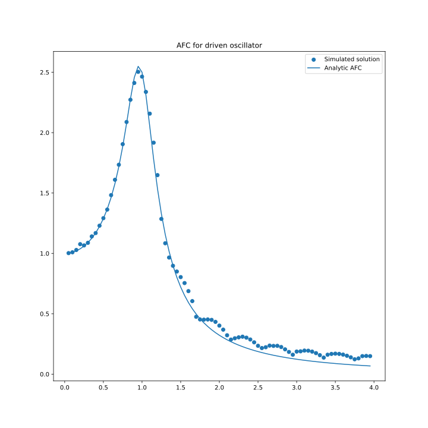
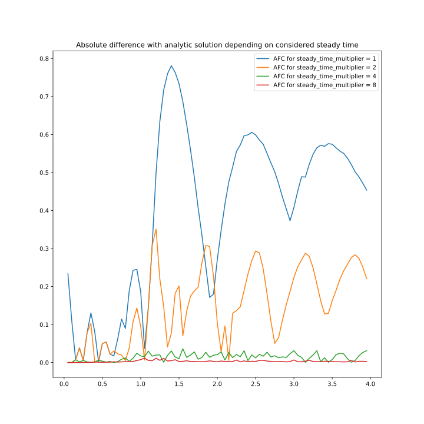
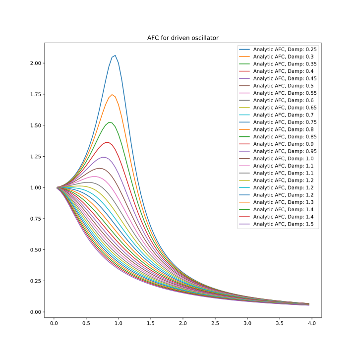

# AFC for harmonic driven oscillator

## General view

Here we see that  analytical AFC differs from simulated one. It's cause is that inital solution haven't faded out yet.

## Steady time

Let's increase time from which we start computing amplitude (so called steady time or decay time):

We see that increase of considered steady time leads to less error.

## How Damp ration influences peak

Here we research how damp ratioinfluences peak position:

We see that increase of damp ration leads to smoothing and shiting peak to the left.