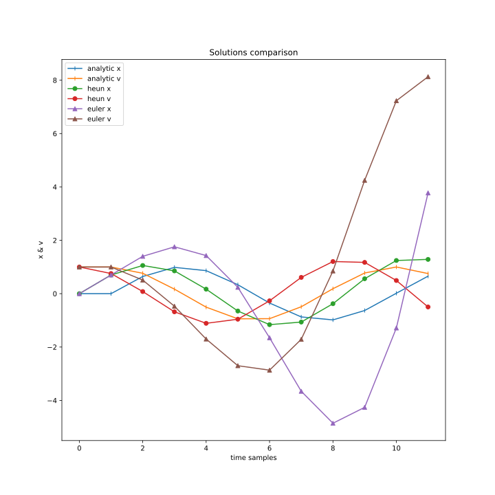
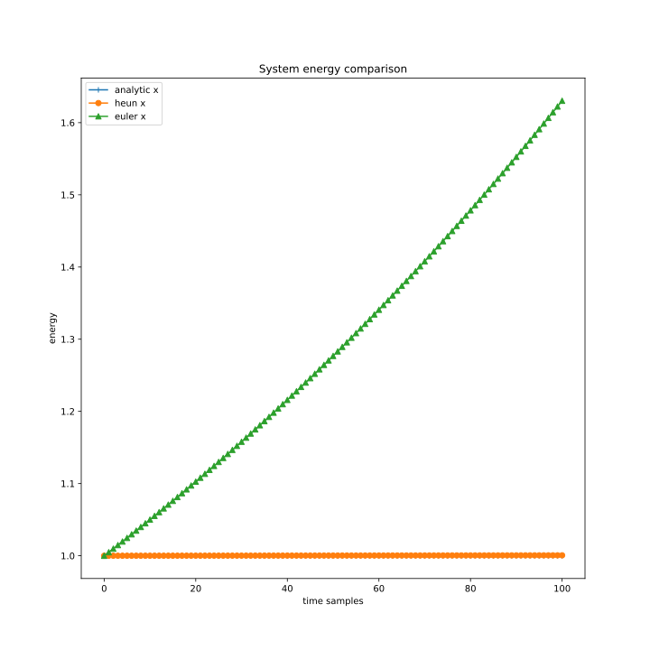
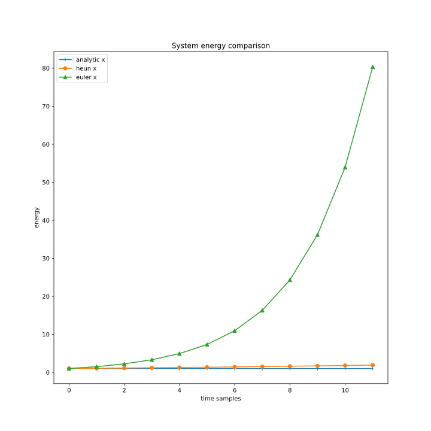
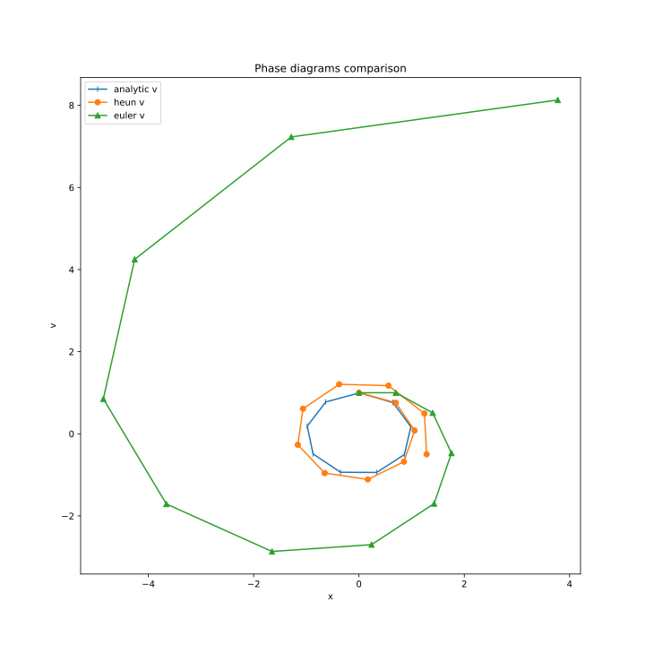

# Harmonic Oscillator Modelling

## What do you do here?

Research numerical methods of solving system of 1st order differential equations.

In this research next methods are compared:

+ [Analytical solution](https://en.wikipedia.org/wiki/Harmonic_oscillator)
+ [Euler method](https://en.wikipedia.org/wiki/Euler_method)
+ [Heun method](https://en.wikipedia.org/wiki/Heun%27s_method)

## Research solution

### Many samples

### Few samples

Euler method and Heun method are iterative processes that are used to get approximate solution.

As you can see on the pictures they do really approximate solution, but with an error.

Euler method increases amplitude of oscillations.
This fact can be observed better if we plot system energy.

## Research energy

### Many samples

### Few samples

Plot demonstrates that energy in the system increases.

But we model conservative system, so it's only called by error of Euler's method.

## Research phase portrait

### Many samples

### Few samples

Phase portrait of conservative system should look like a circle. But as Euler's method ruins energy balance we see unrolling spiral.

## Conclusions

In work