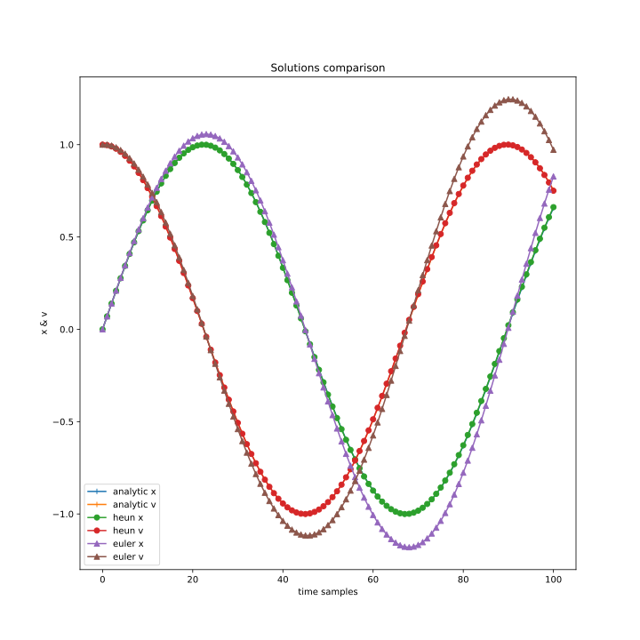
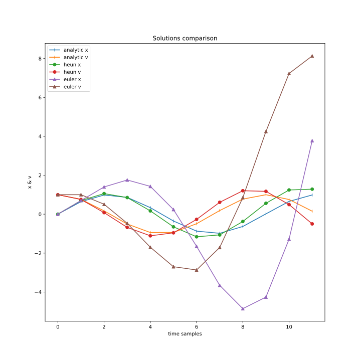
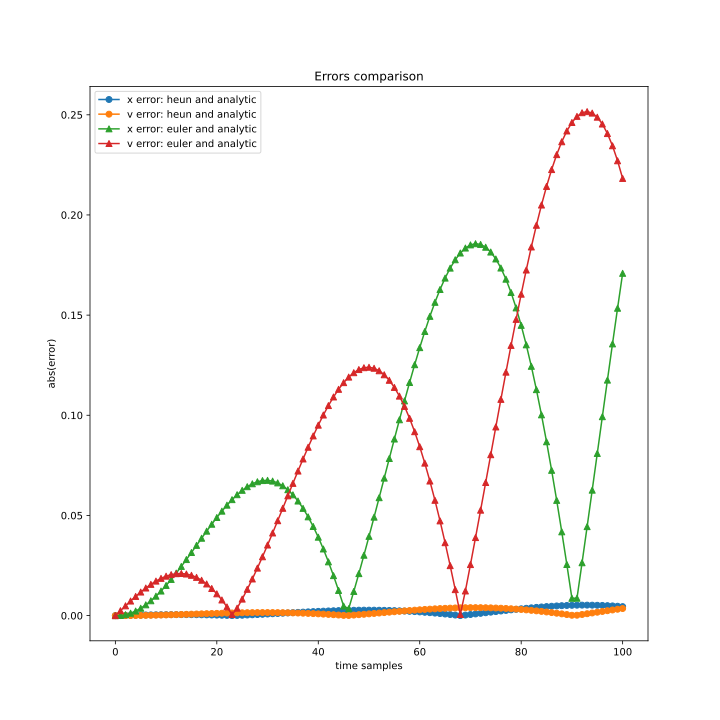
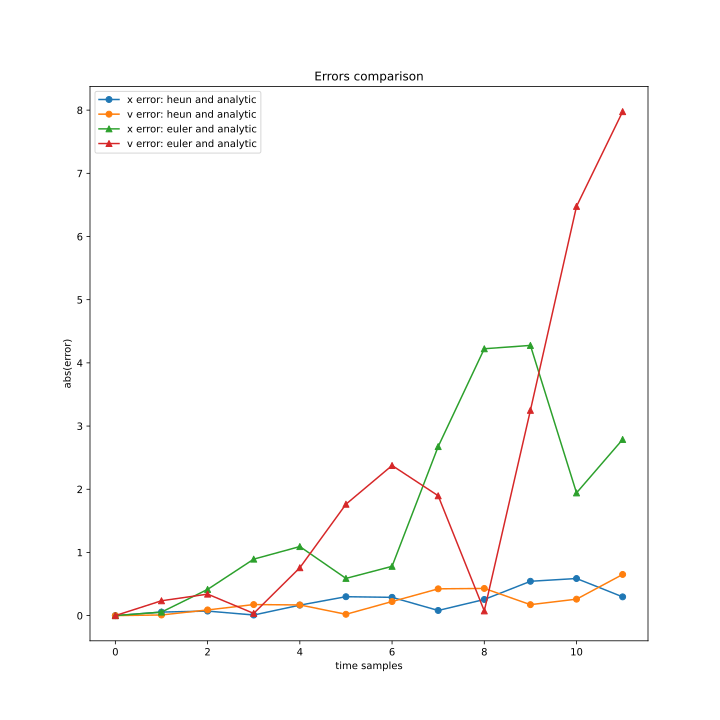
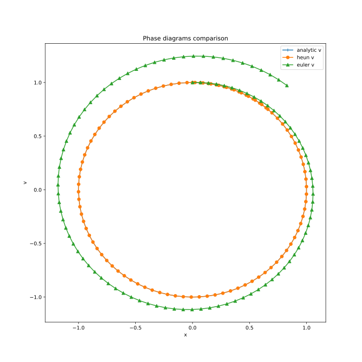
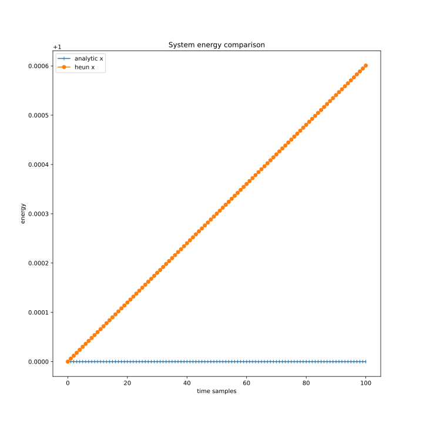
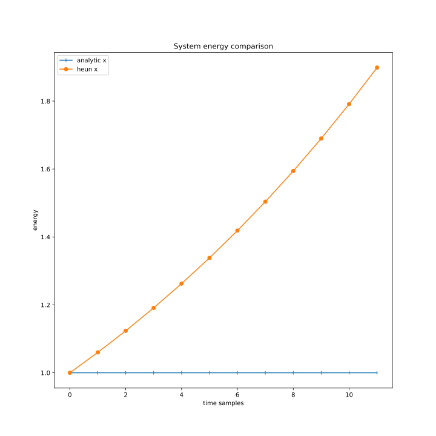
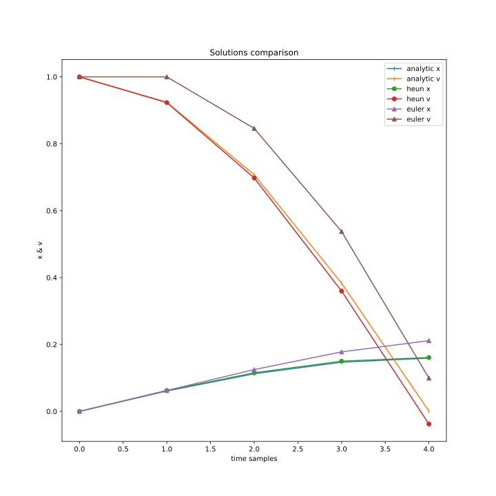

# Harmonic Oscillator Modelling

## What do you do here?

Research numerical methods of solving system of 1st order differential equations.

In this research next methods are compared:

+ [Analytical solution](https://en.wikipedia.org/wiki/Harmonic_oscillator)
+ [Euler method](https://en.wikipedia.org/wiki/Euler_method)
+ [Heun method](https://en.wikipedia.org/wiki/Heun%27s_method)

In plots below research the same time interval [0, 7] and consider $w = 1$.

Few samples - we divide interval into 10 parts.

Many samples - into 100.

## Research solution

### Many samples

### Few samples

Euler method and Heun method are iterative processes that are used to get approximate solution.

As you can see on the pictures they do really approximate solution, but with an error.

Euler method increases amplitude of oscillations.
This fact can be observed better if we plot system energy. It'll be done later.

## Research solution error

### Many samples

### Few samples

This zeros of Euler's method error occured as initial solution is periodic function. So sometimes initial solution intersects with Euler's solution, but that's just a coincidence.

Also we can notice how error depends on samples num. In Few samples case error is ~32 times bigger for Euler's solution.

## Research energy

### Many samples

### Few samples

Plot demonstrates that energy in the system increases.

But we model conservative system, so it's only called by error of Euler's method.

So it's not a right decision to model conservative systems with Euler's method.

## Research phase portrait

### Many samples

### Few samples

Phase portrait of conservative system should look like a circle. But as Euler's method ruins energy balance we see unrolling spiral.

# More detailed review of Heun's method

Plots above can give feeling that Heun's method doesn't corrupt conservative law for the system. But it's too early to claim.

If we plot energy without euler's method we can see:

Energy increases in the system according to Heun's method. But we see that this increase is real small. It needs an additional research to find out whether it is caused by rounding error or not. [Summation method](https://en.wikipedia.org/wiki/Kahan_summation_algorithm) can be applied.

## Research domain of methods

In work

## Conclusions

For understanding results let's consider one more plot:

This plots gives us answer. As initial solution function concaves greatly $A * sin(x) + b * cos(x)$ Euler's method does bad job.

Let's consider time samples with numbers 0 and 1. We will investigate solution for v. Initial value is 1. Original solution's v derivative smoothly decreases. But Euler's method take into account only derivative's value at start of time interval. And considers it constant for the whole interval. That's why Euler's solution is not goes enough down when we compare it with original solution in the end of interval.

Thus as velocity doesn't decrease properly it seems like energy in the system increases. That is proofed by plots in 'Research energy' section.

Otherwise, in Heun's method case it goes better. That's because Heun's method consider that function can concave. So the computed derivative depends on original derivative in both ends of time interval.
