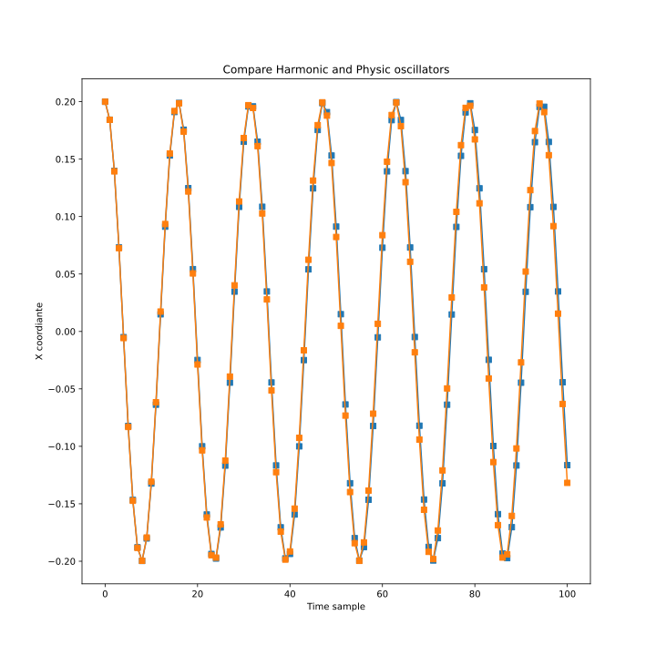
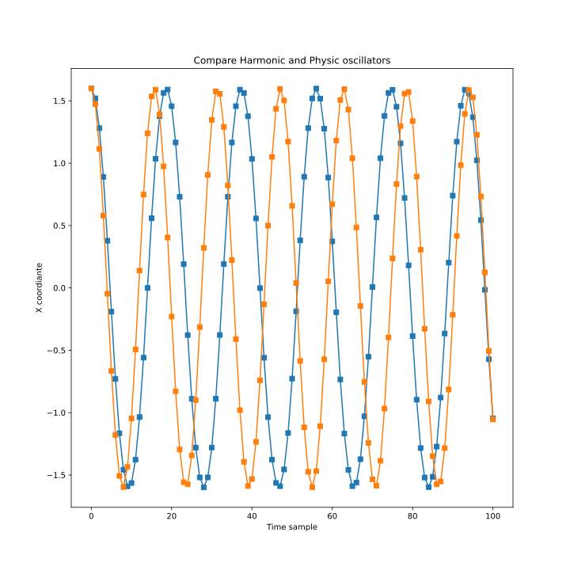
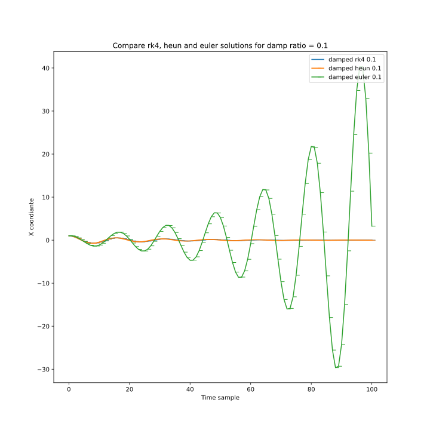
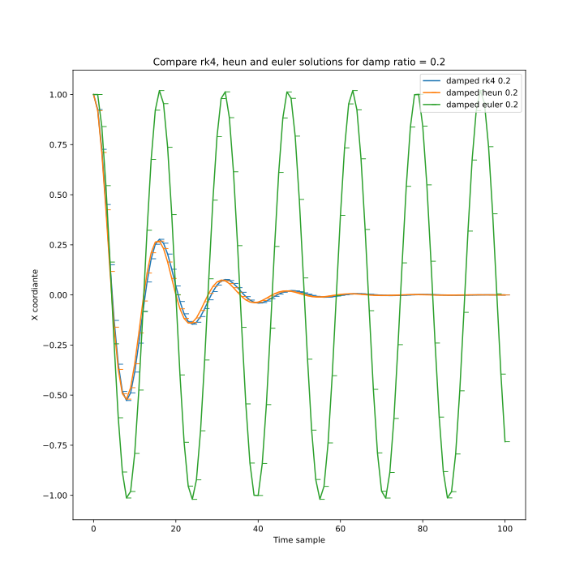
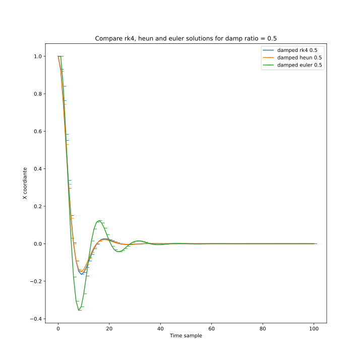

# Research harmonic, physic and damped oscillators

## Criteria of small angle (when physic ~ harmonic?)

Physic and harmonic models behaves the same way if start amplitude is below 0.2.

For amplitude of 0.2 solutions are almost equal.

When we increase start amplitude, difference between solutions grows

Here we start with start amplitude = 1.6

## Damped oscillator with different solvers

Plot with different damp ratios.

We see that with damp ratio = 0 we get harmonic solution.

// increase time interval

Vary damp ration and compare different solve schemes:

With damp ratio = 0.2 we see that euler scheme transforms into harmonic solution.

