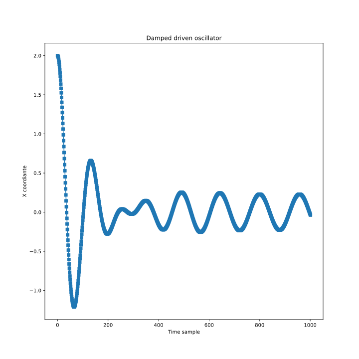
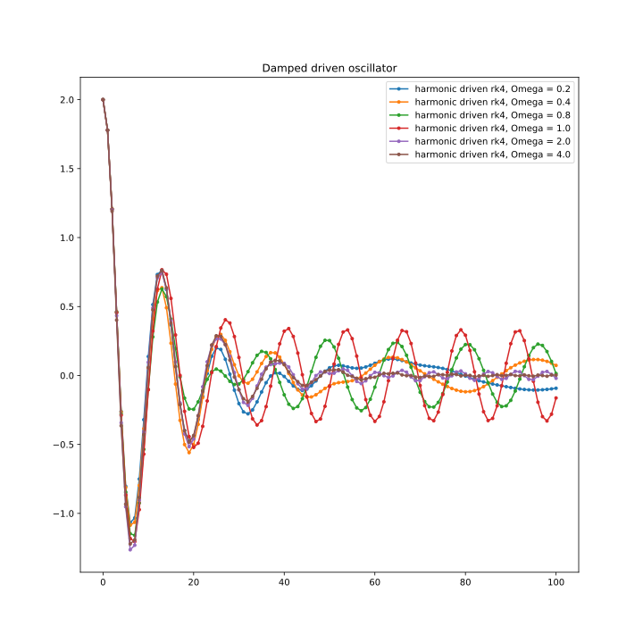

# Harmonic driven oscillator

Research damped driven oscillator under harmonic force.

## General view

Solution for this type of oscillator looks like:

Here we see that original damped solution faded out and harmonic solution remained.

## Different Omegas

Let's change frequency of force:

We see that at certain frequency amplitude is bigger that in the others. This happens when frequency of oscillator matches with frequency of force. This situation is called resonance.
